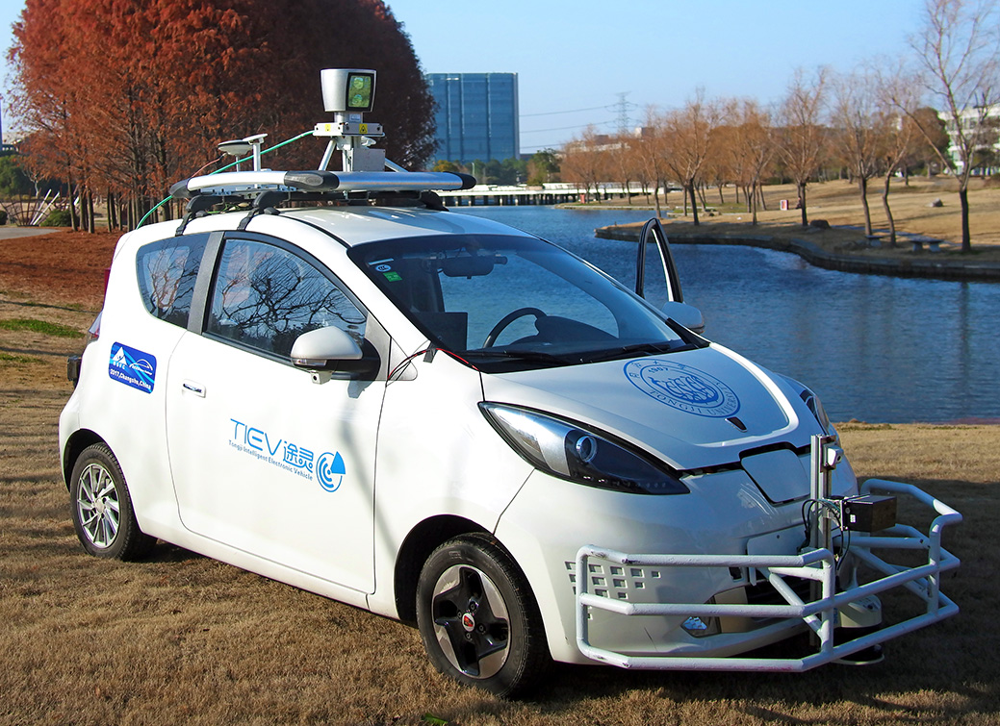
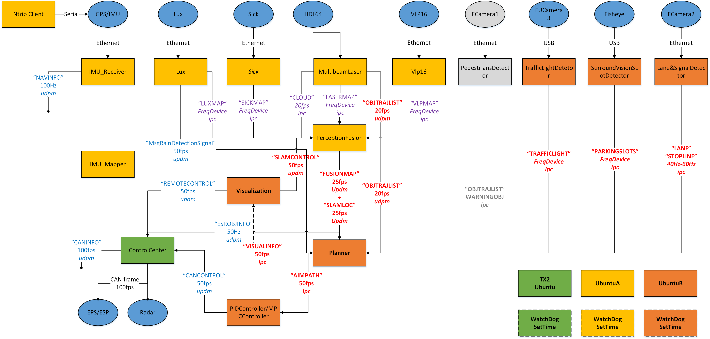
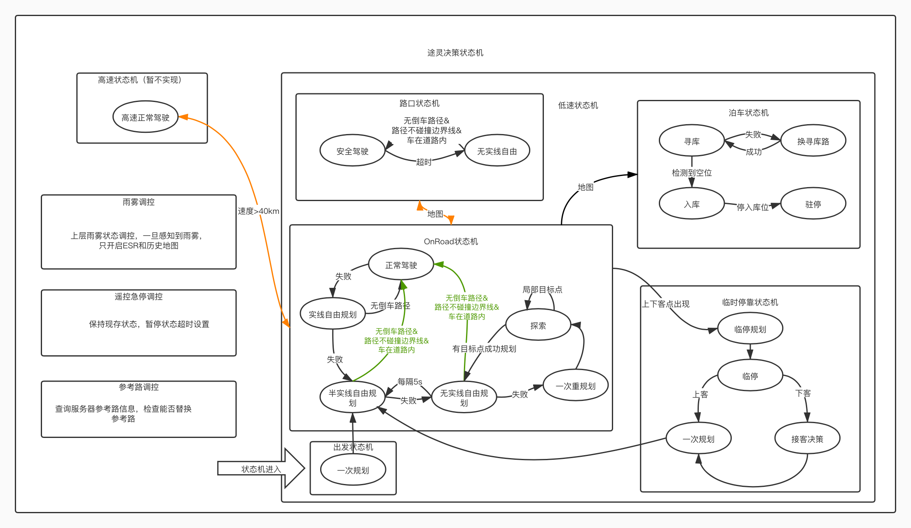

# TiEV2020



```

同济大学途灵无人驾驶团队，旨在打造最简单、通用的无人驾驶技术架构

```

## 途灵架构

### 途灵通讯架构


### 途灵决策状态机


### 途灵E50 操作说明
[操作说明](docs/TiEV_E50操作说明.md)

### 途灵E50 坐标系说明
[操作说明](docs/TiEV_E50坐标系说明.md)


## 安装

#### 需要安装的环境有：

* 通讯环境：ZCM

* 计算机视觉：OpenCV 3.3.0

* 矩阵运算库：Eigen3

  ```
  mkdir build
  ```

  ```
  cd build
  ```

  ```
  cmake ..
  ```

  ```
  make install
  ```

* QP求解库：OSQP

  **注意：OSQP源代码在标识符上与OpenCV产生冲突，冲突的标识符为MAX_ITER与RHO。在tiev2019/src/common/下有修改后的OSQP源代码，如果重新下载源码则需要对上述两个标识符进行全局替换以避免冲突。**

  ```
  mkdir build
  ```

  ```
  cd build
  ```

  ```
  cmake -G "Unix Makefiles" ..
  ```

  ```
  cmake --build .
  ```

  ```
  make install
  ```

  

## 添加新的模块

请大家在modules文件夹下添加自己的模块

## 注意事项

#### ZCM UDP组播网络设置

1. 设置ZCM默认创建形式为UDP，在~/.bashrc文件尾添加

```
export ZCM_DEFAULT_URL=udpm://239.255.76.67:7667?ttl=1
```

此时若没有其他特殊情况zcm已可以在局域网中通讯

2. 若主机有多个网卡，且其中一个网卡为连接外网，则修改主机的路由

* 首先在终端执行

```
ifconfig
```

* 查看连接的网卡名，假设当前连接外网的网口名为eth0，连接内部局域网的网卡为eth1，修改/etc/rc.local

```
sudo vim /etc/rc.local
```

* 在exit 0之前添加

```
#设置默认网关为外网网关，走eth0网卡，这样可以正常访问外网
route add -net 0.0.0.0/0 {外网网卡：eth0}
route add -net 0.0.0.0/0 gw {外网网关地址}
#设置内部局域网要走的网段、网卡、网关地址
route add -net {局域网网段：192.168.0.0}/{子网掩码：24} {局域网网卡：eth1}
route add -net {局域网网段：192.168.0.0}/{子网掩码：24} gw {局域网网关地址}
```

* 多个网卡同上设置，最后开机重启生效

#### 编译

* 在编译前请确保tiev2019/src/modules/planner/planner_tools/config.h中TiEV_CONFIG_DIRECT设置正确
```

...
class Config {
public:
	const string TiEV_CONFIG_DIRECT = "你的tiev2019文件夹绝对路径/tiev2019/src/cfg/";
...
}

```

```

例如：
...
class Config {
public:
	const string TiEV_CONFIG_DIRECT = /home/autolab/tiev2019/src/cfg/";
...
}

```

* 请在tiev/src/cfg/plannerPara.h中正确设置好参考路文件路径、杜宾斯曲线查找表路径和RS曲线查找表文件路径，请全部使用绝对路径。同时设置好其他规划参数。
* 格子分辨率、车身尺寸信息、路面摩擦系数、重力加速度等其他常量在tiev/src/common/nature.h中设置
